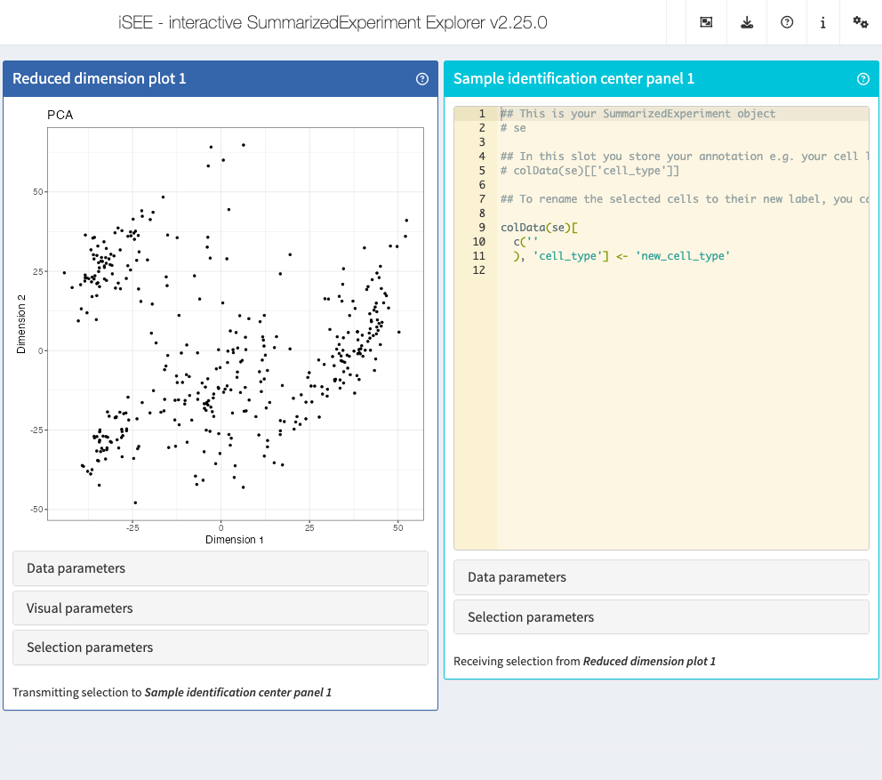

<!-- README.md is generated from README.Rmd. Please edit that file -->

```{r, include = FALSE}
library("BiocStyle")
knitr::opts_chunk$set(
  collapse = TRUE,
  comment = "#>",
  fig.path = "man/figures/README-",
  out.width = "100%"
)
```

# iSEEid

<!-- badges: start -->
[](https://github.com/iSEE/iSEEid/actions/workflows/R-CMD-check-bioc.yaml)
<!-- badges: end -->

The goal of iSEEid is to use `iSEE` to `id`entify cells 

## Installation

Get the latest stable `R` release from [CRAN](http://cran.r-project.org/).  
Then, install `r Biocpkg("iSEEid")` from [Bioconductor](http://bioconductor.org/) using the following code:

```{r 'install', eval = FALSE}
if (!requireNamespace("BiocManager", quietly = TRUE)) {
    install.packages("BiocManager")
}

BiocManager::install("iSEEid")
```

And the development version from [GitHub](https://github.com/iSEE/iSEEid) with:

```{r 'install_dev', eval = FALSE}
BiocManager::install("iSEE/iSEEid")
```

## Example

We use the Allen Brain Atlas dataset from `r BiocStyle::Biocpkg("scRNAseq")` as a running example, pre-processed in a summary manner just for showing most functionality.

```{r example, eval=FALSE}
library("iSEEid")
library("iSEE")
library("scRNAseq")
library("scater")

sce <- ReprocessedAllenData(assays = "tophat_counts")
sce <- logNormCounts(sce, exprs_values = "tophat_counts")
sce <- runPCA(sce, ncomponents = 4)
sce <- runTSNE(sce)

colData(sce)["cell_type"] <- "unassigned"

sce # this is the SummarizedExperiment object you use to store your data

iSEE(sce, initial = list(
  ReducedDimensionPlot(
    PanelWidth = 6L
  ),
  SampleIdentificationCenter(
    ColumnSelectionSource = "ReducedDimensionPlot1",
    PanelWidth = 6L
  )
))
```



## Code of Conduct

Please note that the `r Biocpkg("iSEEid")` project is released with a [Contributor Code of Conduct](http://bioconductor.org/about/code-of-conduct/). 
By contributing to this project, you agree to abide by its terms.

