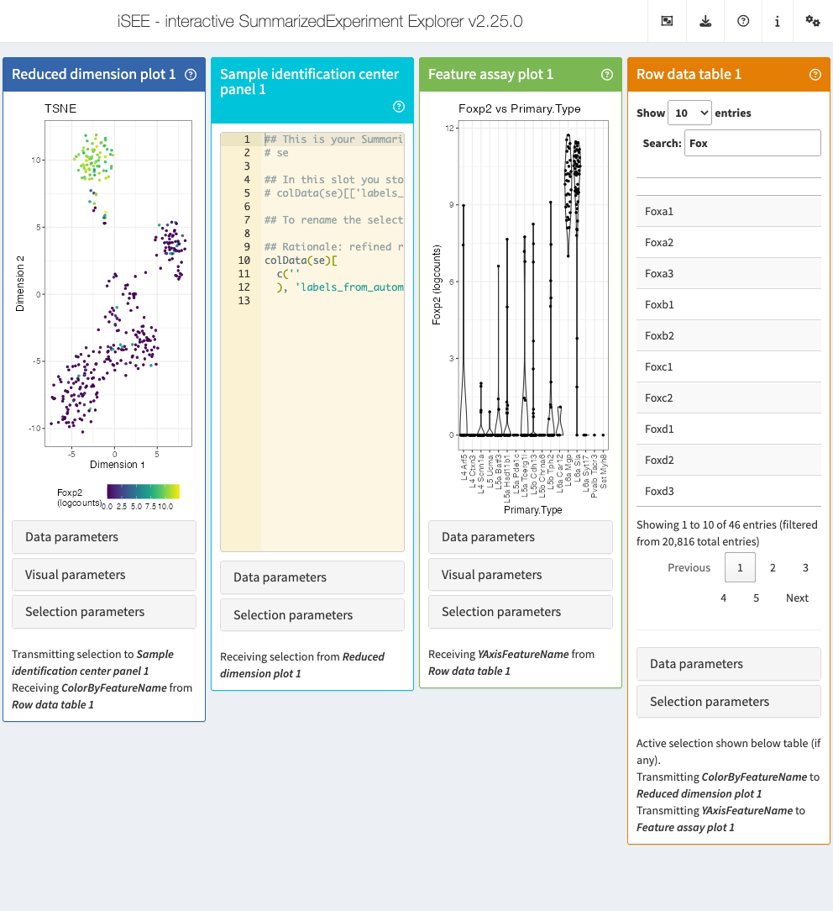

```{r setup, include = FALSE}
knitr::opts_chunk$set(
  collapse = TRUE,
  comment = "#>"
)
```

# Introduction

Cell type annotation is a fundamental step in single-cell RNA-seq analysis, for both smaller datasets as well as for atlas-sized efforts [@Hemberg2025].
While many automated approaches exist [@Traversa2025], manual annotation is still seen as an ubiquitous step to ensure the best identities are assigned [@Andrews2020].
After dimensionality reduction and clustering, analysts need to visually inspect groups of cells, correlate them with known marker genes, and ultimately assign meaningful biological labels. 
This is a process that often times is very labor-intensive, as it typically involves several rounds of back-and-forth between the visualization(s) and the data.

`r BiocStyle::Biocpkg("iSEEid")` extends the `r BiocStyle::Biocpkg("iSEE")` framework [@kra2018iSEE] with a dedicated **Sample Identification Center** panel. 
This panel receives a cell selection transmitted from any other panel (e.g. a brush on a ReducedDimensionPlot) and immediately generates ready-to-use R code to assign a cell type label to those cells — including the `colData` column to write into, the label to assign, and an optional rationale comment for provenance tracking.

The generated command can be copied directly into a script or notebook, making `iSEEid` a natural companion for interactive annotation workflows.


# Installation

`iSEEid` can be installed from Bioconductor with the following code:

```{r installation, eval=FALSE}
if(!requireNamespace('BiocManager', quietly = TRUE))
  install.packages('BiocManager')

BiocManager::install("iSEEid")
```

Load the package after installation with

```{r load_package, message=FALSE}
library("iSEEid")
```


# Demonstrating the usage of `iSEEid`

## Setting up example data

We use the Allen Brain Atlas dataset from `r BiocStyle::Biocpkg("scRNAseq")` as a running example, pre-processed
with `r BiocStyle::Biocpkg("scater")`.

```{r setup-data}
library("iSEE")
library("iSEEid")
library("scRNAseq")
library("scater")
library("scrapper")

sce <- ReprocessedAllenData(assays = "tophat_counts")
sce <- normalizeRnaCounts.se(sce, assay.type = "tophat_counts", size.factors = NULL)
sce <- runPCA(sce, ncomponents = 4)
sce <- runTSNE(sce)

colData(sce)["cell_type"] <- "unassigned"
```

## Launching the app

A minimal setup pairs a `ReducedDimensionPlot` with a `SampleIdentificationCenter` - this is possible in a scripted manner via the `initial` parameter. 
The `ColumnSelectionSource` argument wires these two panels together from the start, so any brush or lasso drawn on the plot can be immediately reflected in the annotation panel.

```{r launch-app, eval=FALSE}
iSEE(sce, initial = list(
  ReducedDimensionPlot(
    PanelWidth = 6L
  ),
  SampleIdentificationCenter(
    ColumnSelectionSource = "ReducedDimensionPlot1",
    PanelWidth = 6L
  )
))
```

# The `SampleIdentificationCenter` panel


The panel consists of two parts:

- a **Text editor** (top) showing either a ready-to-run R command or a plain
  list of cell IDs, updated live as the upstream selection changes;
- a **Data parameters** box (bottom) with controls to customize what the
  editor produces, whereas the **Selection parameters** box allows to change the 
  source e.g. for the column selection.

```{r figbasic, fig.cap="A basic configuration for using iSEEid.", echo=FALSE}
knitr::include_graphics("appshot_basic_iSEEid.png")
```
  
Among the essential data parameters, we have:

* A **checkbox**, to show the full, executable R command, or alternatively the plain 
  text form of the selected cells. It can have this form, generally:

```r
## This is your SummarizedExperiment object
# se

## In this slot you store your annotation e.g. your cell label
# colData(se)[['cell_type']]

## To rename the selected cells to their new label, you can use the command(s) below

## Rationale: high Cd3e / Cd4 expression
colData(se)[
  c('cell_A',
    'cell_B',
    ...
  ), 'cell_type'] <- 'CD4+ T cells'
```

  When unchecked, the editor switches to a plain list of cell IDs - this can be useful when you just need the names to pass to another tool or paste into a spreadsheet (you still probably should not use Excel for this...).

* The **Annotation rationale**: this is a free-text field to record *why* you are making this assignment — e.g.
*high Cd3e / Cd4 expression*.
  When non-empty, the text is injected as a `## Rationale:` comment immediately above the assignment command, providing lightweight provenance directly inside the generated code.

* The `colData column` to be used for annotation: The name of the `colData` column where labels should be stored.
  This column must already exist in your object. Defaults to `cell_type`.

* The **Cell type label**, i.e. the label to assign to the selected cells, which becomes the right-hand side of the assignment (when generating the commands). This defaults to `new_cell_type`, but you can easily replace it with the actual label before copying the command — e.g. `CD4+ T cells`, `Microglia`, `Monocytes`.


# How to perform annotation within `iSEEid`

A typical session with `iSEEid` looks like this:

1. Open `iSEE` with a `ReducedDimensionPlot` linked to a `SampleIdentificationCenter`.
1. Brush or lasso a group of cells that cluster together in the reduced dimension plot.
1. Optionally inspect the selected cells in other linked panels — e.g. a `FeatureAssayPlot` to check marker gene expression, or a `ColumnDataTable` to browse their metadata.
1. In the `SampleIdentificationCenter`, fill in the **colData column**, the **cell type label**, and optionally a **rationale**.
1. Copy the generated command from the editor into your analysis script or notebook and run it to write the annotation back into the object.
1. Rinse and repeat for each cell population of interest.

Because the command is generated fresh on every selection change, you can iterate at will — refine the brush, update the label, copy again — without any risk of accidentally overwriting prior annotations already committed
to the object.

An important note: `iSEE` does *not* execute these commands for you - nor changes silently the provided object.
This is a clear design choice!

# Customizing the initial state for efficient annotation

All panel slots can be set at construction time, allowing you to pre-fill sensible defaults for your dataset:

```{r custom-init, eval=FALSE}
iSEE(sce, initial = list(
  ReducedDimensionPlot(
    PanelWidth = 3L,
    Type = "TSNE",
    ColorBy = "Feature name",
    ColorByFeatureSource = "RowDataTable1"
  ),
  SampleIdentificationCenter(
    ColumnSelectionSource = "ReducedDimensionPlot1",
    PanelWidth = 3L,
    ColDataColumn = "labels_from_automated_tool",
    CellTypeLabel = "new_cell_type",
    AnnotationRationale = "refined round: looking explicitly for markers"
  ),
  FeatureAssayPlot(
    PanelWidth = 3L,
    XAxis = "Column data", 
    XAxisColumnData = "Primary.Type",
    YAxisFeatureSource = "RowDataTable1"
  ),
  RowDataTable(
    PanelWidth = 3L,
    Selected = "Foxp2", 
    Search = "Fox"
  )
))
```

```{r figadvanced, fig.cap="A somewhat more complex example of iSEEid in action, with some extra panels.", echo=FALSE}

```
 
Of course, more complex configurations are also possible - if not even required, in complex datasets.
For these cases, we suggest the users to create a panel configuration by hand, directly within `iSEE`, and export that afterwards with its native functionality.

# Session info {-}

```{r sessioninfo}
sessionInfo()
```

# Bibliography
